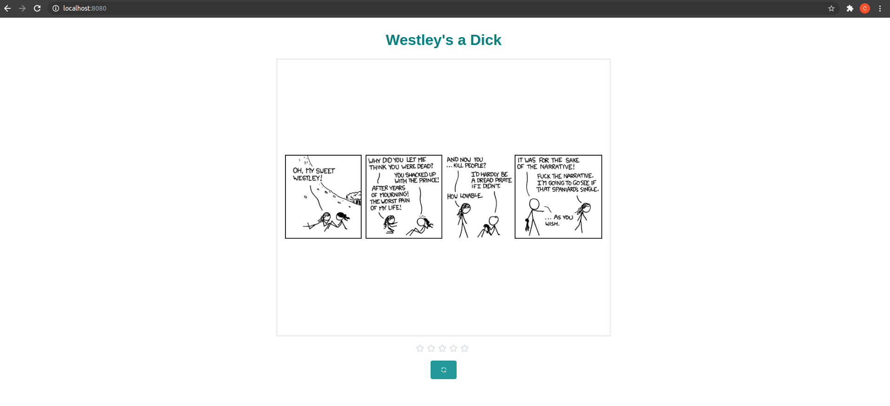

# comics

### Es necesario tener instalados npm y node.js, así que de no tenerlos instalados, se puede guiar por estos videos (dependiendo de si es linux o windows):
```
https://www.youtube.com/watch?v=wPp8tLPHagI
https://www.youtube.com/watch?v=X-FPCwZFU_8
```

### En la raiz del proyecto (carpeta "comics"), instalar dependencias así:
```
npm install
```

### Correr aplicación (hecha con Vue.js)
```
npm run serve
```

### Ingresar a la app por medio de la URL:

```
http://localhost:8080/
```


